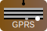

<div style="text-align: center;">
  <a href="https://crates.io/crates/gprs"></a>
</div>

<div style="text-align: center;">
  <a href="https://github.com/dr-montasir/gprs"></a> <a href="https://crates.io/crates/gprs"></a> <a href="https://docs.rs/gprs"></a> <a href="https://choosealicense.com/licenses/apache-2.0"></a> <a href="https://choosealicense.com/licenses/mit"></a>
</div>

# GPRS

**GPRS** provides a curated selection of optimized Rust libraries as a modular foundation for modern web frameworks. Each crate acts as a distinct module, enabling seamless integration and customization. With version control on each crate, developers gain greater stability and flexibility, enhancing maintainability and scalability while harnessing Rust's power for high-performance web applications.

---

## Table of Contents

- [Installation](#installation)
- [Changelog](#changelog)
- [Usage](#usage)
- [Documentation](#documentation)
- [License](#license)
- [Contributing](#contributing)
- [Author](#author)

## Installation

**Run the following Cargo command in your project directory:**

```terminal
cargo add gprs
```

**Or add `gprs` to your `Cargo.toml` file:**

```toml
[dependencies]
gprs = "MAJOR.MINOR.PATCH" # Replace with the latest version
```

## Changelog

[](https://github.com/dr-montasir/gprs/blob/main/CHANGELOG.md)

## Usage

```rust
use gprs::asyncore::task;
// use gprs::cans::do_html;
use gprs::cans::html::{do_forloop, do_html, do_text};
use gprs::ghttp::status::status_map;
use std::time::Duration;

async fn print_numbers(from: i32, to: i32) {
    for i in from..to {
        println!("{}", i32::abs(i));

        task::sleep(Duration::from_millis(1000)).await
    }
}

pub const HEAD: &str = r#"<head>
<meta charset="UTF-8">
    <title>{{page_title}} Page</title>
</head>"#;

pub const HOME_TEMPLATE: &str = r#"<!DOCTYPE html>
<html>
  {{HEAD}}
  <body>
     Home Page
  </body>
</html>"#;

pub fn do_home_page() -> String {
    do_html!(HOME_TEMPLATE, HEAD = HEAD, page_title = do_text("Home"))
}

pub const ABOUT_TEMPLATE: &str = r#"<!DOCTYPE html>
<html>
  {{HEAD}}
  <body>
     About Page
  </body>
</html>"#;

pub fn do_about_page() -> String {
    do_html!(ABOUT_TEMPLATE, HEAD = HEAD, page_title = do_text("About"))
}

#[gprs::main]
async fn main() {
    let task_1 = task::spawn(print_numbers(-3, 0));
    task::block_on(task_1);

    println!("{}", do_text(r#"Hello, World!"#));

    let status_code = 200;
    let message = status_map(status_code);

    println!("Status Code: {}, Message: {}", status_code, message);

    let html_template = r#"
    <!DOCTYPE html>
    <html>
        <head>
            <meta charset="UTF-8">
            <title>GPRS | {{page_title}}</title>
        </head>
        <ol>
        </ol>
        <h1>👋 {{hello}}, {{world}}</h1>
        <p>
            {{component_if}}
        </p>
        <div>{{forloop_float}}<div>
        <div>{{forloop_float_ol}}<div>
    </html>
    "#;

    let world = "World!";

    let component_if: &str;
    let x = 3;

    if x == 1 {
        component_if = "<a href='#'><i>x = 1</i></a>";
    } else if x == 2 {
        component_if = "<a href='#'><i>x = {{x}}</i></a>";
    } else {
        component_if = "<a href=\"#\"><i>x ≠ 1 & x  ≠ 2. The 'x' value is ( {{x}} )</i></a>";
    };

    let float_vector = vec![1.0, 2.0, 3.0];
    let forloop_float = do_forloop(&float_vector, "", "", "", "");
    let forloop_float_ol = do_forloop(
        &float_vector,
        "<ol style='list-style: square;'>",
        "<li>",
        "</li>",
        "</ol>",
    );

    let html_to_string = do_html!(
        html_template,
        page_title = do_text("Home Page"),
        hello = "Hello",
        world = world,
        component_if = component_if,
        x = x,
        forloop_float = forloop_float,
        forloop_float_ol = forloop_float_ol
    );

    println!("{}", do_home_page());

    println!("{}", html_to_string);

    println!("{}", do_about_page());

    let task_2 = task::spawn(print_numbers(1, 4));
    task::block_on(task_2);
}
```

### Result

```shell
3
2
1
Hello, World!
Status Code: 200, Message: OK
<!DOCTYPE html>
<html>
  <head>
<meta charset="UTF-8">
    <title>Home Page</title>
</head>
  <body>
     Home Page
  </body>
</html>

    <!DOCTYPE html>
    <html>
        <head>
            <meta charset="UTF-8">
            <title>GPRS | Home Page</title>
        </head>
        <ol>
        </ol>
        <h1>👋 Hello, World!</h1>
        <p>
            <a href="#"><i>x ≠ 1 & x  ≠ 2. The 'x' value is ( 3 )</i></a>
        </p>
        <div>123<div>
        <div><ol style='list-style: square;'><li>1</li><li>2</li><li>3</li></ol><div>
    </html>

<!DOCTYPE html>
<html>
  <head>
<meta charset="UTF-8">
    <title>About Page</title>
</head>
  <body>
     About Page
  </body>
</html>
1
2
3
```

## Documentation

- [asyncore crate docs](https://docs.rs/asyncore/latest/asyncore)
- [cans crate](https://crates.io/crates/cans)
- [chief crate](https://crates.io/crates/chief)
- [ghttp crate docs](https://docs.rs/ghttp/latest/ghttp)
- [mathlab crate (math module)](https://crates.io/crates/mathlab)
- [parser module: serde crate](https://crates.io/crates/serde)
- [parser module: serde_json crate](https://crates.io/crates/serde_json)
- [regexy crate](https://crates.io/crates/regexy)
- [runtime module: tokio crate](https://crates.io/crates/tokio)
- [wtime crate](https://crates.io/crates/wtime)

## License

This project is licensed under either of the following licenses:

- MIT License
- Apache License, Version 2.0

You may choose either license for your purposes.

## Contributing

Contributions are welcome! Please feel free to submit a pull request or open an issue for any feature requests or bug reports.

## Author

[Dr. Montasir Mirghani](https://github.com/dr-montasir)
